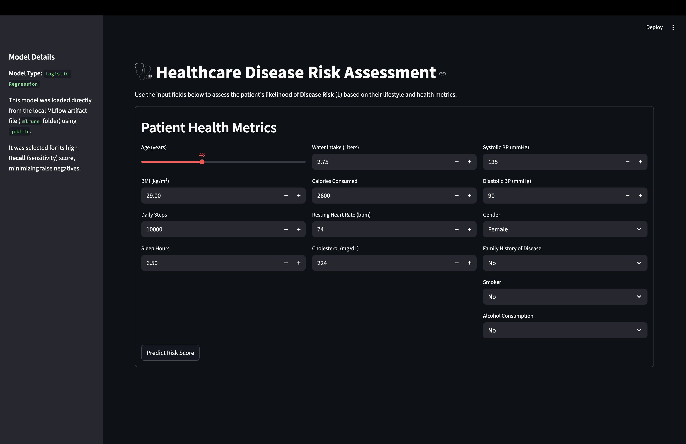
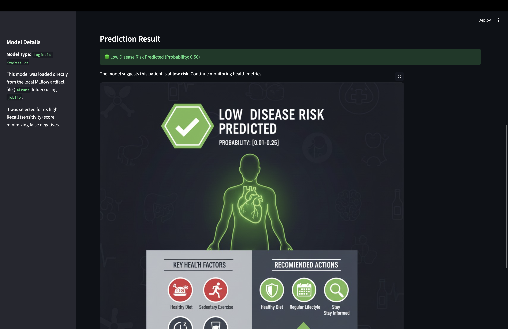

# Healthcare Analytics: Disease Risk Prediction

## Project Overview
This project is part of the **INFO 531: Data Warehousing and Analytics in the Cloud** course (Fall 2025). It focuses on healthcare analytics, specifically aiming to predict disease risks based on lifestyle and health metrics. By analyzing factors such as physical activity, diet, and physiological markers, the project seeks to identify key drivers of disease and healthy lifestyles[cite: 1].

## Dataset
The analysis utilizes a dataset of **100,000 records** containing **16 health and lifestyle-related features**[cite: 1].
* **Source:** Kaggle 
* **Target Variable:** `disease_risk` (Binary)
    * `0`: Low Risk
    * `1`: High Risk

### Key Features
The dataset includes 14 predictor variables across several categories:
* **Demographic:** Age, Gender (Encoded)
* **Anthropometric:** BMI
* **Physical Activity:** Daily Steps
* **Lifestyle/Habit:** Sleep Hours, Water Intake, Smoking Status, Alcohol Use
* **Diet:** Calories Consumed
* **Physiological:** Resting Heart Rate, Systolic & Diastolic Blood Pressure
* **Biomarker:** Cholesterol Level
* **Medical History:** Family History

## System Design

## Demo Development Images:

## Data Preparation Plan
To ensure high-quality input for machine learning models, the following preparation steps are implemented[cite: 1]:

1.  **Data Cleaning:**
    * Scan for and remove duplicate entries.
    * Verify missing values (though none are expected).
    * **Feature Exclusion:** Drop the `ID` column as it holds no predictive value.

2.  **Transformation & Encoding:**
    * **Categorical Encoding:** Convert `gender` to numerical format using One-Hot Encoding (`gender_Male`, `gender_Female`).
    * **Scaling:** Apply `StandardScaler` to continuous numerical features to normalize variance (critical for distance-based algorithms).

3.  **Handling Class Imbalance:**
    * The dataset has a 25% High Risk / 75% Low Risk split.
    * Strategies include adjusting class weights (`class_weight='balanced'`) and applying **SMOTE** (Synthetic Minority Over-sampling Technique) to the training set if necessary.

## Methodology

### Data Partitioning
* **Split Ratio:** 80% Training / 20% Testing[cite: 1].
* **Validation:** k-fold cross-validation ($k=5$) is applied to the training set for hyperparameter tuning[cite: 1].

### Machine Learning Models
The project employs a two-pronged modeling approach[cite: 1]:

1.  **Baseline Model: Logistic Regression (LR)**
    * Chosen for its interpretability and ability to provide clear coefficients for risk factors.
2.  **Primary Model: Random Forest Classifier (RFC)**
    * Selected for its robustness to non-linear interactions, resistance to overfitting, and ability to provide feature importance scores.
3.  **Additional Models:** Support Vector Machines (SVMs) and XGBoost may be explored for robust accuracy.

## Evaluation Metrics
Given the class imbalance, the project prioritizes metrics beyond standard accuracy[cite: 1]:
* **F1-Score:** To balance precision and recall.
* **ROC-AUC:** To measure discrimination ability across thresholds.
* **Recall (Sensitivity):** To minimize false negatives (missing high-risk patients), which is critical in a clinical setting.

## Results:

| Model | Accuracy | Recall | F1 Score | ROC AUC |
| :--- | :--- | :--- | :--- | :--- |
| **Logistic Regression** | 0.49980 | 0.503828 | 0.333333 | 0.503064 |
| **Random Forest** | 0.71055 | 0.065673 | 0.101227 | 0.495568 |
| **XGBoost** | 0.74365 | 0.017123 | 0.032094 | 0.494139 |
| **SVC** | 0.50435 | 0.479654 | 0.324497 | 0.490195 |

## Requirements
* **Language:** Python
* **Libraries:**
    * `scikit-learn` (for models, scaling, and metrics)
    * `pandas` (for data manipulation)
    * `numpy` (for numerical operations)
